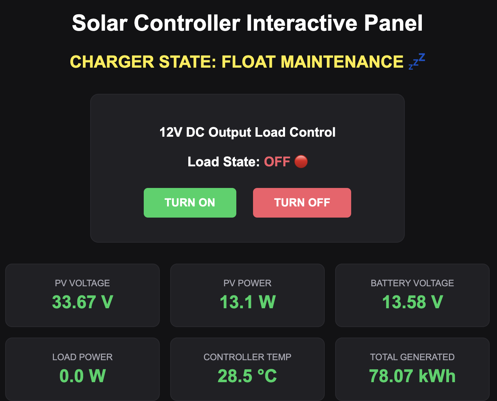

# EPEVER Tracer 3210AN MPPT Solar Dashboard

## 📊 Interface Sample Preview


A lightweight, local Python-based monitoring and control utility for the **EPEVER Tracer 3210AN MPPT Solar Charge Controller** using the **EPEVER Wi-Fi 2.4G RJ45 D** dongle. 

This project bypasses the EPEVER cloud completely, communicating directly with the hardware dongle over the local network via **Modbus TCP (RTU over TCP)** framing. It features an interactive real-time terminal display and a Flask web server capable of actively switching the controller's physical 12V DC load terminals.

---

## 🚀 Features Completed
*   **Direct Local Communication:** Bypassed the cloud API using Python's raw network sockets and `pymodbus v3.15` frameworks over the local home Wi-Fi extender bridge network (Port `9999`).
*   **Hardware Cold-Start Initialization:** Solved the power-down maintenance lockout trap by injecting an explicit hexadecimal `"magic packet"` (`20020000`) to force-wake the adapter's internal RS485 chip during initialization sequences.
*   **Comprehensive Telemetry Parsing:** Extracted array input data, battery bus status, controller unit temperatures, external probe diagnostics, and 32-bit historical energy yield total accumulators (`kWh`).
*   **12V DC Output Load Control:** Enabled remote operational manipulation of the physical 12V output terminals on the MPPT unit by mapping dynamic read/write register requests directly to Modbus Coil `0x0002`.
*   **Environment Sanitation & Security:** Rolled out `python-dotenv` variables to protect infrastructure details (IP addresses, Port assignments, Device IDs) from public exposure on version control platforms.

---

## 📁 Repository Layout
```text
epever-solar-dashboard/
├── .env.example          # Blank configuration template for public distribution
├── .gitignore            # Security filter separating secrets and system environments
├── README.md             # Project documentation
├── terminal_solar.py     # Local SSH console loop UI 
└── control_dashboard.py  # Interactive Flask Web Server panel
```

---

## 🛠️ Step-by-Step Deployment

### 1. Hardware & Dongle Pre-requisites
1. Power up your **EPEVER 3210AN** and plug in the Wi-Fi dongle.
2. Connect a phone or computer to the dongle's local access point network (`HN_EP...`).
3. Open `Dongle IP Router` (Login: `admin` / `admin`).
4. Ensure the system network communication parameters are mapped strictly to **TCP Server** broadcasting on Port **`9999`**.
5. Switch the device to concurrent **AP/STA Mode**, connect it to your home Wi-Fi network, and grab its IP address from your router's client portal.

### 2. Local Environment Installation
On your Raspberry Pi, clone or deploy the files into a clean folder, isolate your dependencies within a Virtual Environment, and install packages:
```bash
# Initialize project folder
mkdir -p ~/epever-dashboard && cd ~/epever-dashboard

# Build out and launch isolated environment
python3 -m venv env
source env/bin/activate

# Install essential dependencies
pip install pymodbus==3.15 python-dotenv flask
```

### 3. Setup Configuration
Generate a local hidden `.env` text module using the example file:
```bash
cp .env.example .env
nano .env
```
Fill out your specific parameters securely:
```text
EPEVER_DONGLE_IP=XXX.XXX.X.XXX  # Your Wi-Fi extender/router portal client IP
EPEVER_PORT=9999
EPEVER_DEVICE_ID=1
```

---

## 💻 Running the Utilities

### Option A: Local Terminal View
To benchtest and inspect telemetry frames directly over your headless SSH console shell pipeline loop:
```bash
python terminal_solar.py
```

### Option B: Interactive Flask Web Server
To launch a multi-client interactive automation panel accessible from any browser on your home network network link:
```bash
python control_dashboard.py
```
Once active, navigate your browser to `http://<YOUR_RASPBERRY_PI_IP>:5000/` to visualize live arrays and toggle the 12V terminal switch.

---

## 🔒 Security Best Practices Reminders
To keep system configurations hidden, ensure your tracker index ignores runtime elements before making a commit to GitHub:
```bash
# Add to local .gitignore file
env/
__pycache__/
.env
```
Verify files staging explicitly prior to pushing code online using: `git diff --cached --name-only`.
